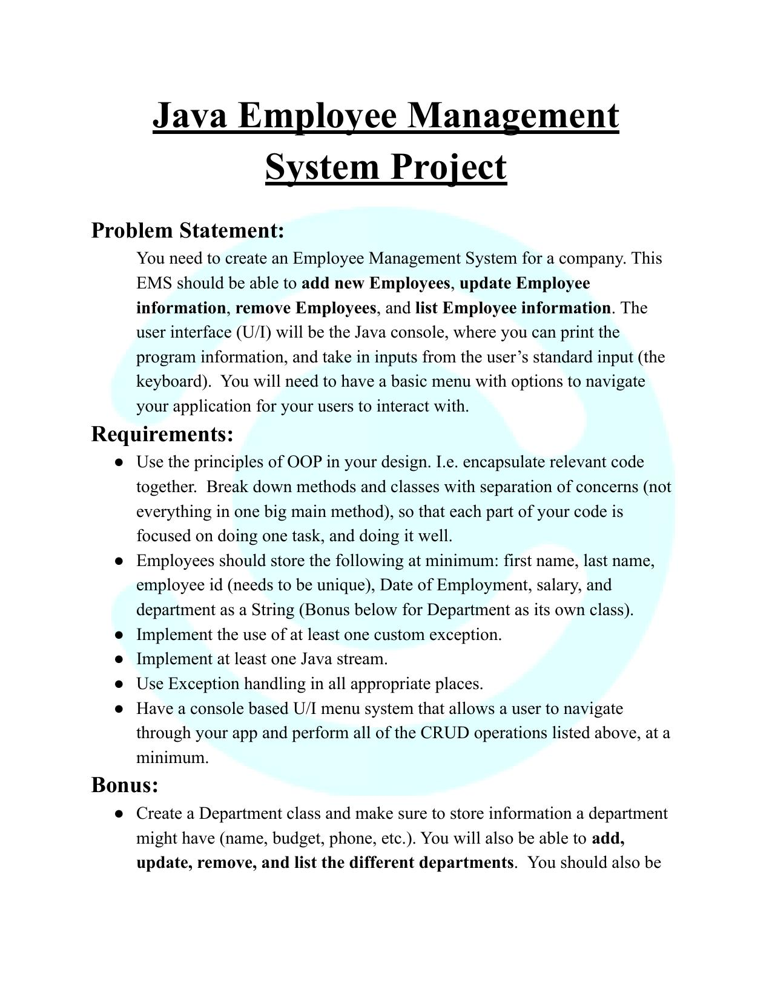
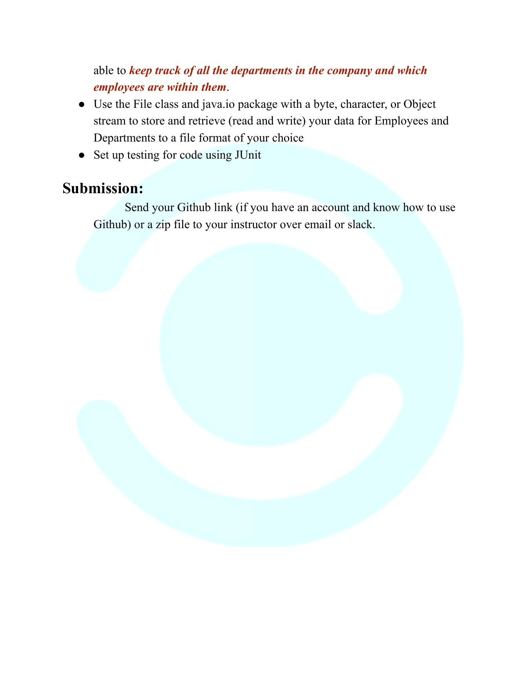

- [x] Use principles of OOP in your design.
- [x] Employees with a minimum of: 
> - First name.
> - Last name.
> - ID.
> - Date of employment.
> - Salary.
> - Department.
- [x] Implement custom exceptions.
- [x] Use java streams.
- [x] Use exception handling in all appropriate places.
- [x] Make a CLI to navigate and perform all the CRUD operations.

### Bonus
- [x] unit testing with JUnit

 

